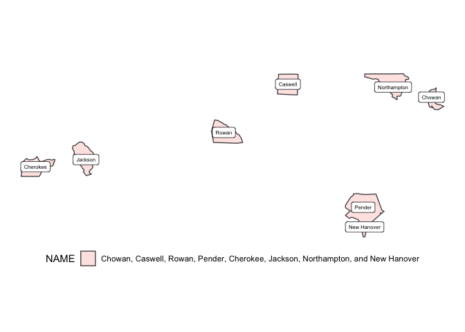

<!-- README.md is generated from README.Rmd. Please edit that file -->

# sfext <a href="https://elipousson.github.io/sfext/"></a>

<!-- badges: start -->

[](https://CRAN.R-project.org/package=sfext)
[](https://lifecycle.r-lib.org/articles/stages.html#experimental)
[](https://opensource.org/licenses/MIT)
[](https://app.codecov.io/gh/elipousson/sfext?branch=main)
[](https://www.repostatus.org/#active)
<!-- badges: end -->

The goal of sfext is to extend existing functions from the {sf} package
and offer a range of additional options for working with simple feature
objects, bounding boxes, and data frame objects with coordinates or
other spatial information.

## Installation

You can install the development version of sfext like so:

``` r
# pak::pkg_install("elipousson/sfext")
```

## Examples

``` r
library(ggplot2)
library(sfext)

theme_set(theme_void())
```

Get data with read_sf_ext and related functions:

``` r
nc <- read_sf_ext(path = system.file("shape/nc.shp", package = "sf"))
```

Combine data with st_union_ext:

``` r
random_id <- sample(nrow(nc), size = 8)
nc_union <- st_union_ext(nc[random_id, ], name_col = "NAME")

ggplot() +
  geom_sf(data = nc_union, aes(fill = NAME), alpha = 0.2) +
  geom_sf_label(data = nc[random_id, ], aes(label = NAME), size = 2) +
  theme(legend.position = "bottom")
#> Warning in st_point_on_surface.sfc(sf::st_zm(x)): st_point_on_surface may not
#> give correct results for longitude/latitude data
```

 Make
grids set rows, columns, and aspect ratios using st_make_grid_ext:

``` r
# Make a 5 by 5 grid with a 8.5 by 11 aspect ratio filtered to x
plot(
  st_make_grid_ext(
    x = nc[24, ],
    asp = 8.5 / 11,
    ncol = 5,
    nrow = 5,
    filter = TRUE
  )
)
```


