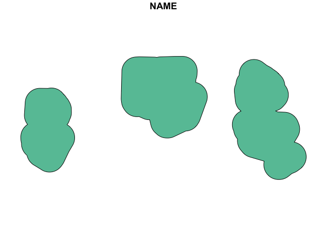
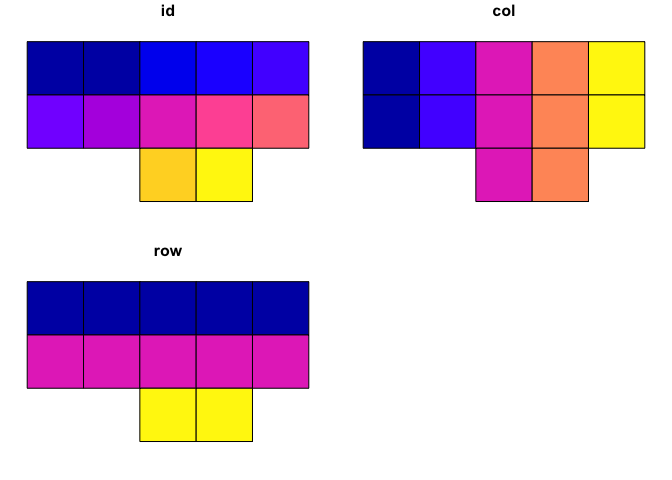
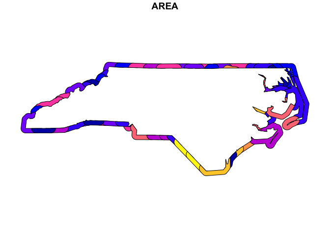
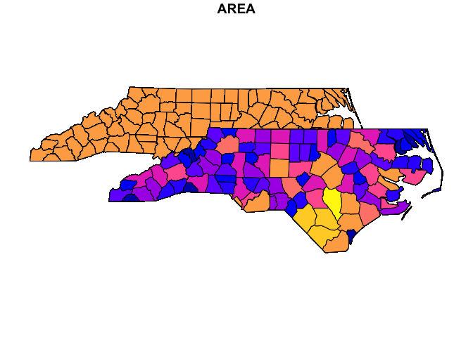
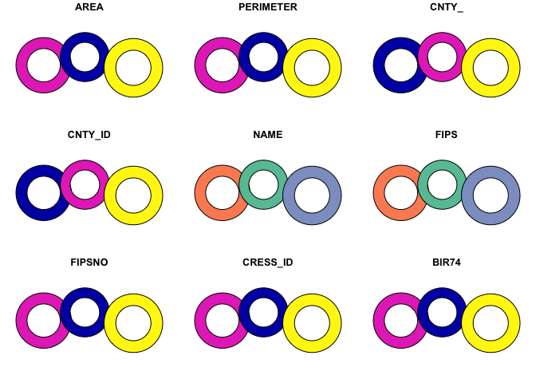
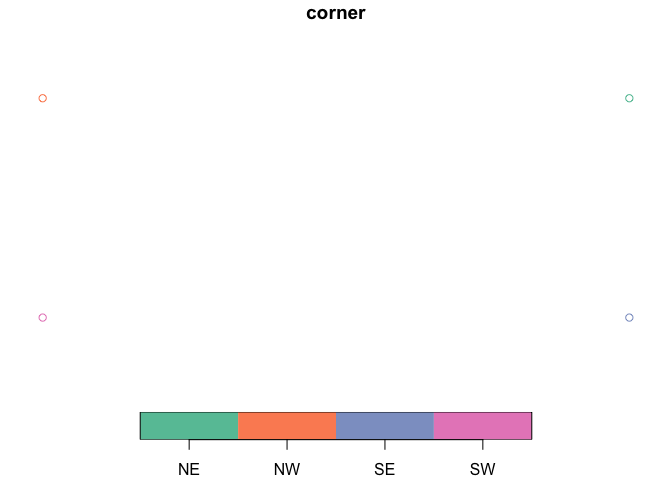

<!-- README.md is generated from README.Rmd. Please edit that file -->

# sfext <a href="https://elipousson.github.io/sfext/"></a>

<!-- badges: start -->

[](https://CRAN.R-project.org/package=sfext)
[](https://lifecycle.r-lib.org/articles/stages.html#experimental)
[](https://opensource.org/licenses/MIT)
[](https://app.codecov.io/gh/elipousson/sfext?branch=main)
[](https://www.repostatus.org/#active)
<!-- badges: end -->

The goal of sfext is to extend existing functions from the [{sf}
package](https://r-spatial.github.io/sf/) and offer a range of
additional options for working with simple feature objects, bounding
boxes, and data frame objects with coordinates or other spatial
information.

## Installation

You can install the development version of sfext like so:

``` r
# pak::pkg_install("elipousson/sfext")
```

## Usage

``` r
library(sfext)
```

### Extending existing {sf} functions

`{sfext}` is built around existing sf functions but designed to offer
greater flexibility around both inputs and outputs. For example,
`read_sf_ext()` is a wrapper for `sf::read_sf()` and offers a similar
functionality:

``` r
nc <- read_sf_ext(system.file("shape/nc.shp", package = "sf"))
```

However, `read_sf_ext()` also supports URLs for Google Sheets,
FeatureLayers, data included with an installed package, and a variety of
other sources. The function also supports an optional bounding box
filter.

``` r
read_sf_ext("https://carto.nationalmap.gov/arcgis/rest/services/govunits/MapServer/29", bbox = as_bbox(nc))
#> ── Downloading "National Park" from <]8;;https://carto.nationalmap.gov/arcgis/rest/services/govunits/MapServer/29https://carto.nationalmap.gov/arcgis/rest/s]8;;
#> Layer type: "Feature Layer"
#> Geometry type: "esriGeometryPolygon"
#> Service CRS: "EPSG:3857"
#> Output CRS: "EPSG:3857"
#> 
#> Simple feature collection with 11 features and 19 fields
#> Geometry type: MULTIPOLYGON
#> Dimension:     XY
#> Bounding box:  xmin: -13326920 ymin: 4005420 xmax: -7672089 ymax: 5887098
#> Projected CRS: WGS 84 / Pseudo-Mercator
#> First 10 features:
#>    OBJECTID                 PERMANENT_IDENTIFIER SOURCE_FEATUREID
#> 1      6533 2216d26b-da64-4b83-b316-449f9b44b1d0             MAPR
#> 2      6564 7086b7cc-08b6-4a4b-8faa-5b9d94d97f4a             KIMO
#> 3      6669 f135ee2b-e71d-4bce-8cc2-be7cfb7bbcd4             WRBR
#> 4      6706 d9eec3c0-ae13-4ef9-a17b-dc4858cd39d4             CALO
#> 5      6755 c248d769-1a64-4b77-a215-d4d58f361cbc             BLRI
#> 6      6796 643dde5f-5633-4af5-b0b8-f61540ddbf61             CAHA
#> 7      6804 bc97c677-3de2-478b-9d41-6da7ce83f29e             GRSM
#> 8      7571 adf43046-fa1b-4bdc-8341-031e00ed799a             CUGA
#> 9      7574 8aa2a0c5-aec3-4b30-8795-14d18265a8b8             CHAT
#> 10     7583 7cc31c7a-dda3-4b97-9fac-006c34c5c8b1             GUCO
#>                          SOURCE_DATASETID                 SOURCE_DATADESC
#> 1  {562524A1-7D6A-40EA-AA44-2E9AEF4488EB} National Park Boundaries 3/2020
#> 2  {562524A1-7D6A-40EA-AA44-2E9AEF4488EB} National Park Boundaries 3/2020
#> 3  {562524A1-7D6A-40EA-AA44-2E9AEF4488EB} National Park Boundaries 3/2020
#> 4  {562524A1-7D6A-40EA-AA44-2E9AEF4488EB} National Park Boundaries 3/2020
#> 5  {562524A1-7D6A-40EA-AA44-2E9AEF4488EB} National Park Boundaries 3/2020
#> 6  {562524A1-7D6A-40EA-AA44-2E9AEF4488EB} National Park Boundaries 3/2020
#> 7  {562524A1-7D6A-40EA-AA44-2E9AEF4488EB} National Park Boundaries 3/2020
#> 8  {02A04210-8E12-46EA-89C7-B48F91616971} National Park Boundaries 9/2020
#> 9  {02A04210-8E12-46EA-89C7-B48F91616971} National Park Boundaries 9/2020
#> 10 {02A04210-8E12-46EA-89C7-B48F91616971} National Park Boundaries 9/2020
#>        SOURCE_ORIGINATOR DATA_SECURITY DISTRIBUTION_POLICY     LOADDATE GNIS_ID
#> 1  National Park Service             5                  E4 1.586355e+12 2775864
#> 2  National Park Service             5                  E4 1.586355e+12 1223739
#> 3  National Park Service             5                  E4 1.586355e+12 1027483
#> 4  National Park Service             5                  E4 1.586355e+12 1000889
#> 5  National Park Service             5                  E4 1.586355e+12 1009494
#> 6  National Park Service             5                  E4 1.586355e+12  982628
#> 7  National Park Service             5                  E4 1.586355e+12 1018241
#> 8  National Park Service             5                  E4 1.602058e+12  490476
#> 9  National Park Service             5                  E4 1.602058e+12 1688073
#> 10 National Park Service             5                  E4 1.602058e+12  986193
#>                                            NAME     AREASQKM FTYPE FCODE
#> 1    Manhattan Project National Historical Park    0.4598436   674 67400
#> 2         Kings Mountain National Military Park   15.9040186   674 67400
#> 3             Wright Brothers National Memorial    1.7347265   674 67400
#> 4                Cape Lookout National Seashore  115.0050251   674 67400
#> 5                            Blue Ridge Parkway  384.0079655   674 67400
#> 6               Cape Hatteras National Seashore  125.9856098   674 67400
#> 7           Great Smoky Mountains National Park 2096.4740275   674 67400
#> 8       Cumberland Gap National Historical Park   98.4687290   674 67400
#> 9  Chattahoochee River National Recreation Area   48.0789992   674 67400
#> 10   Guilford Courthouse National Military Park    0.9179617   674 67400
#>    ADMINTYPE OWNERORMANAGINGAGENCY SHAPE_Length   SHAPE_Area
#> 1          1                    13     14168.45     776550.8
#> 2          1                    13     22120.44   23836721.4
#> 3          1                    13      9434.39    2657056.5
#> 4          1                    13    233295.32  171056451.0
#> 5          1                    13   2202935.37  596234809.6
#> 6          1                    13    345532.78  190369152.0
#> 7          1                    13    808754.04 3178103336.6
#> 8          1                    13    164570.70  153181997.9
#> 9          1                    13    326590.96   70142647.4
#> 10         1                    13     10228.17    1410140.4
#>                                       GNIS_NAME                          geoms
#> 1    Manhattan Project National Historical Park MULTIPOLYGON (((-9394763 42...
#> 2         Kings Mountain National Military Park MULTIPOLYGON (((-9062982 41...
#> 3             Wright Brothers National Memorial MULTIPOLYGON (((-8423490 43...
#> 4                Cape Lookout National Seashore MULTIPOLYGON (((-8468201 41...
#> 5                            Blue Ridge Parkway MULTIPOLYGON (((-9271423 42...
#> 6               Cape Hatteras National Seashore MULTIPOLYGON (((-8415559 42...
#> 7           Great Smoky Mountains National Park MULTIPOLYGON (((-9267417 42...
#> 8       Cumberland Gap National Historical Park MULTIPOLYGON (((-9313282 43...
#> 9  Chattahoochee River National Recreation Area MULTIPOLYGON (((-9359559 40...
#> 10   Guilford Courthouse National Military Park MULTIPOLYGON (((-8886905 43...
```

`st_union_ext()` is nearly identical to `sf::st_union()` but optionally
preserve a name column (collapsing the values of that column into a
single string):

``` r
random_id <- sample(nrow(nc), size = 8)

nc_union <- st_union_ext(nc[random_id, ], name_col = "NAME")

plot(
  nc_union
)
```


`st_buffer_ext()` wraps `sf::st_buffer()` but accepts bounding box
objects as an input, allows you to set the units for the buffer distance
using a character string (automatically converts the buffer distance
units to match the units of the input object):

``` r
# Apply a 20 mile buffer to the unioned geometry
plot(
  st_buffer_ext(nc_union, dist = 20, unit = "mi")
)
```



`st_make_grid_ext()` wraps `sf::st_make_grid()` but makes it easy to set
the dimensions of the grid using rows, columns, and an overall aspect
ratio:

``` r
# Make a 5 by 5 grid with a 8.5 by 11 aspect ratio filtered to x
plot(
  st_make_grid_ext(
    x = nc,
    asp = 11 / 8.5,
    ncol = 5,
    nrow = 5,
    filter = TRUE
  )
)
```



Most functions that include a `crs` parameter can convert the coordinate
reference system of the output (using `transform_sf()` or
`sf_bbox_transform()`). The crs parameter also supports sf, sfc, or bbox
inputs. Functions that include a `class` parameter can convert the class
of an object using `as_sf_class()`. There are a set of functions for
class conversion that typically wrap multiple sf functions with more
limited input options.

``` r
nc_bbox <- as_bbox(nc, crs = 4326)

nc_bbox
#>      xmin      ymin      xmax      ymax 
#> -84.32377  33.88212 -75.45662  36.58973

as_sfc(nc[1, ], crs = 3857)
#> Geometry set for 1 feature 
#> Geometry type: MULTIPOLYGON
#> Dimension:     XY
#> Bounding box:  xmin: -9099356 ymin: 4332928 xmax: -9043563 ymax: 4382074
#> Projected CRS: WGS 84 / Pseudo-Mercator
#> MULTIPOLYGON (((-9069486 4332928, -9077065 4338...

as_sf(nc_bbox, crs = nc)
#> Simple feature collection with 1 feature and 0 fields
#> Geometry type: POLYGON
#> Dimension:     XY
#> Bounding box:  xmin: -84.32386 ymin: 33.88198 xmax: -75.45697 ymax: 36.58967
#> Geodetic CRS:  NAD27
#>                         geometry
#> 1 POLYGON ((-84.32385 33.8819...
```

Please note this flexibility make `{sfext}` easy to use (especially in
an interactive context) but likely *not* appropriate for reproducible
research. The package is being actively developed and the API may
change.

### Additional helper functions for `sf` objects

sfext also includes several helper functions that add new features by
combining functions from the {sf} package, using [affine
geometry](https://r-spatial.github.io/sf/articles/sf3.html#affine-transformations),
or adding features from other packages.

For example, `st_edge()` combines `sf::st_buffer()` and
`sf::st_difference()` to get the “edges” of any geometry.

``` r
plot(
  st_edge(nc, dist = 10, unit = "mi"),
  max.plot = 1
)
```



`st_nudge()` allows you to shift the position of an `sf` object to a new
location:

``` r
nc_nudge <- st_nudge(nc, to = nc[1, ])

plot(
  st_union_ext(
    nc,
    nc_nudge
  ),
  max.plot = 1
)
```



`st_donut()` allows you to create donuts around existing features:

``` r
plot(
  st_donut(nc[c(1, 2, 3), ])
)
#> Warning: plotting the first 9 out of 15 attributes; use max.plot = 15 to plot
#> all
```



Lastly, the package has a whole group of helper functions for bbox
objects. For example, `sf_bbox_corners()` creates a sf object with POINT
geometry based on the corners of a bounding box:

``` r
plot(
  sf_bbox_corners(
    as_bbox(nc)
  )
)
```



## Related projects

`{sfext}` *depends* on two other development packages:

- [{papersize}](https://elipousson.github.io/papersize/): A collection
  of convenience functions extending grid, ggplot2, and patchwork to
  help in sizing plots and files for printing to paper, postcards,
  playing cards, and other physical media.
- [{filenamr}](https://elipousson.github.io/filenamr/): A package to
  help create and modify file names and paths (that also supports
  reading and writing EXIF metadata).

It is also *used* extensively by two other development packages:

- [{getdata}](https://elipousson.github.io/getdata/): A package to make
  the experience of getting location data easier and more consistent
  across a wide variety of sources.
- [{maplayer}](https://elipousson.github.io/maplayer/): A consistent set
  of functions for creating map layers for
  [{ggplot2}](https://ggplot2.tidyverse.org/) using simple feature data.

There are *many* packages that build on sf for a variety of specialized
use cases. A few worth noting include:

- [{sfdep}](https://github.com/JosiahParry/sfdep): A sf and tidyverse
  friendly interface to the spdep package for spatial dependence.
- [{sfnetworks}](https://github.com/luukvdmeer/sfnetworks): Tidy
  Geospatial Networks in R.
- [{sfhotspot}](https://github.com/mpjashby/sfhotspot): A set of
  functions to identify and understand clusters of points (typically
  representing the locations of places or events).
- [{sfx}](https://seasmith.github.io/packages/sfx/): Extra ‘sf’ Simple
  Features manipulations.
