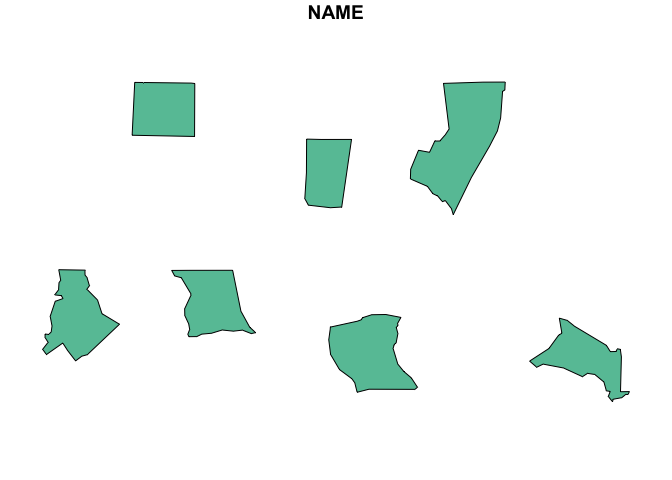
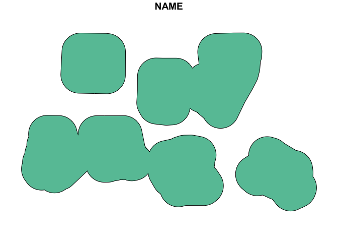
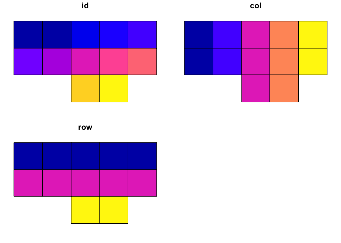
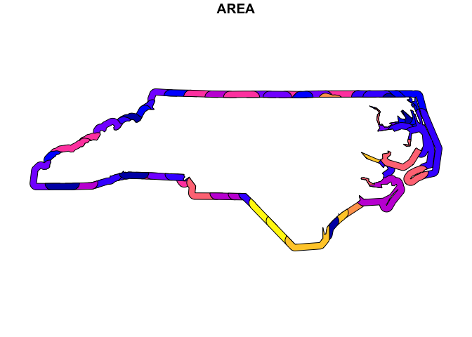
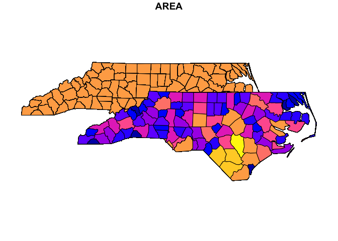
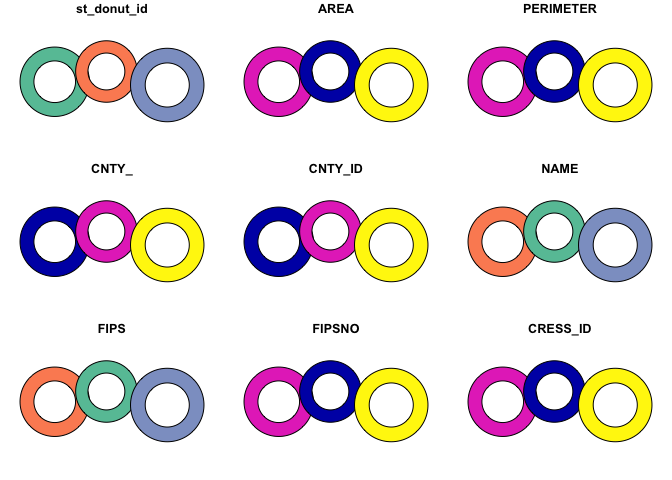
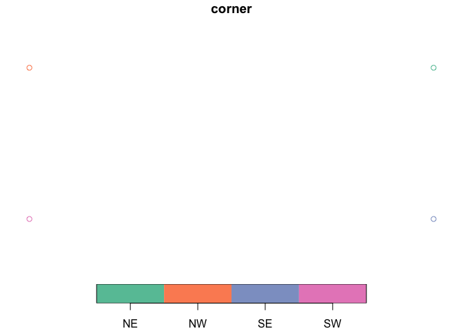

<!-- README.md is generated from README.Rmd. Please edit that file -->

# sfext <a href="https://elipousson.github.io/sfext/"></a>

<!-- badges: start -->

[](https://CRAN.R-project.org/package=sfext)
[](https://lifecycle.r-lib.org/articles/stages.html#experimental)
[](https://opensource.org/licenses/MIT)
[](https://app.codecov.io/gh/elipousson/sfext?branch=main)
[](https://www.repostatus.org/#active)
<!-- badges: end -->

The goal of sfext is to extend existing functions from the [{sf}
package](https://r-spatial.github.io/sf/) and offer a range of
additional options for working with simple feature objects, bounding
boxes, and data frame objects with coordinates or other spatial
information.

## Installation

You can install the development version of sfext like so:

``` r
# pak::pkg_install("elipousson/sfext")
```

## Usage

``` r
library(sfext)
```

### Extending existing {sf} functions

`{sfext}` is built around existing sf functions but designed to offer
greater flexibility around both inputs and outputs. For example,
`read_sf_ext()` is a wrapper for `sf::read_sf()` and offers a similar
functionality:

``` r
nc <- read_sf_ext(system.file("shape/nc.shp", package = "sf"))
```

However, `read_sf_ext()` also supports URLs for Google Sheets,
FeatureLayers, data included with an installed package, and a variety of
other sources. The function also supports an optional bounding box
filter.

``` r
read_sf_ext(
  "https://carto.nationalmap.gov/arcgis/rest/services/govunits/MapServer/29",
  bbox = as_bbox(nc)
)
#> ── Downloading "National Park" from <https://carto.nationalmap.gov/arcgis/rest/s
#> Layer type: "Feature Layer"
#> Geometry type: "esriGeometryPolygon"
#> Service CRS: "EPSG:3857"
#> Output CRS: "EPSG:3857"
#> 
#> Simple feature collection with 16 features and 19 fields
#> Geometry type: MULTIPOLYGON
#> Dimension:     XY
#> Bounding box:  xmin: -9402550 ymin: 4005420 xmax: -8400179 ymax: 4584128
#> Projected CRS: WGS 84 / Pseudo-Mercator
#> First 10 features:
#>    boundarytype objectid                   permanent_identifier
#> 1             2    53213 {9fb6cd5d-441e-4c03-8426-3d4a803b07ef}
#> 2             2    53214 {865a3fe2-32c2-49d5-b68a-369f275b2c99}
#> 3             2    53242 {13e0e432-4a08-4be9-9a72-d50cb0928ed1}
#> 4             2    53309 {fdc693d6-c52b-489b-9acc-c4d29e3c6f46}
#> 5             2    53314 {4b27e664-6774-4cfb-9178-b7c76e3ca08b}
#> 6             2    53316 {d24ebeca-8f82-4b89-a46c-26fb0d76562e}
#> 7             2    53349 {9ca2f545-de4e-4c0d-a224-82035fd2a7bd}
#> 8             2    53350 {c351c3b1-85ee-46c5-880a-1e6965336690}
#> 9             2    53413 {a420e645-7448-4b7a-b3ff-213cef9cb543}
#> 10            2    53440 {3a21fb09-637b-4068-82ef-0ced22096e54}
#>    source_featureid                       source_datasetid source_datadesc
#> 1                NA {ee9f836e-d0af-4231-9111-e0026212f8c6}      PAD-US 4.1
#> 2                NA {ee9f836e-d0af-4231-9111-e0026212f8c6}      PAD-US 4.1
#> 3                NA {ee9f836e-d0af-4231-9111-e0026212f8c6}      PAD-US 4.1
#> 4                NA {ee9f836e-d0af-4231-9111-e0026212f8c6}      PAD-US 4.1
#> 5                NA {ee9f836e-d0af-4231-9111-e0026212f8c6}      PAD-US 4.1
#> 6                NA {ee9f836e-d0af-4231-9111-e0026212f8c6}      PAD-US 4.1
#> 7                NA {ee9f836e-d0af-4231-9111-e0026212f8c6}      PAD-US 4.1
#> 8                NA {ee9f836e-d0af-4231-9111-e0026212f8c6}      PAD-US 4.1
#> 9                NA {ee9f836e-d0af-4231-9111-e0026212f8c6}      PAD-US 4.1
#> 10               NA {ee9f836e-d0af-4231-9111-e0026212f8c6}      PAD-US 4.1
#>                source_originator data_security distribution_policy    loaddate
#> 1  U.S. Geological Survey (USGS)             5                  E4 1.76899e+12
#> 2  U.S. Geological Survey (USGS)             5                  E4 1.76899e+12
#> 3  U.S. Geological Survey (USGS)             5                  E4 1.76899e+12
#> 4  U.S. Geological Survey (USGS)             5                  E4 1.76899e+12
#> 5  U.S. Geological Survey (USGS)             5                  E4 1.76899e+12
#> 6  U.S. Geological Survey (USGS)             5                  E4 1.76899e+12
#> 7  U.S. Geological Survey (USGS)             5                  E4 1.76899e+12
#> 8  U.S. Geological Survey (USGS)             5                  E4 1.76899e+12
#> 9  U.S. Geological Survey (USGS)             5                  E4 1.76899e+12
#> 10 U.S. Geological Survey (USGS)             5                  E4 1.76899e+12
#>                                            name     areasqkm ftype fcode
#> 1       Cumberland Gap National Historical Park   45.7183508   674 67400
#> 2       Cumberland Gap National Historical Park   21.8506152   674 67400
#> 3    Manhattan Project National Historical Park    0.2315734   674 67400
#> 4             Wright Brothers National Memorial    1.7347268   674 67400
#> 5    Guilford Courthouse National Military Park    0.9179618   674 67400
#> 6         Kings Mountain National Military Park   15.9040317   674 67400
#> 7           Great Smoky Mountains National Park 1120.8767616   674 67400
#> 8           Great Smoky Mountains National Park  975.5980353   674 67400
#> 9  Chattahoochee River National Recreation Area   48.0655438   674 67400
#> 10            Appalachian National Scenic Trail   37.3091713   674 67400
#>    admintype ownerormanagingagency                               globalid
#> 1          1                    13 {3F1C3525-CD9F-4D69-AEEC-BBEDFAE4D4D1}
#> 2          1                    13 {CE87DABE-96B0-4258-B6BA-A94C3F92E79B}
#> 3          1                    13 {94B8C8E9-AEE6-4C42-81F3-19997D374D46}
#> 4          1                    13 {A5E2ACC1-E00A-41E9-88CD-E614D585408C}
#> 5          1                    13 {52054BAF-CC96-4DAE-A467-F4F7B4A0E149}
#> 6          1                    13 {8B638689-4E1B-4993-A793-8424784CEF38}
#> 7          1                    13 {E8FF82C4-1169-482A-828B-AFAB64E5F156}
#> 8          1                    13 {515DF85C-0CAA-4073-8D47-A43B08F2C7AB}
#> 9          1                    13 {BFB5D087-A446-4AFC-89AE-4454783ADDBE}
#> 10         1                    13 {0207A41A-C33C-466A-9A0F-E10338C4DF07}
#>    shape_Length   shape_Area                          geoms
#> 1    113682.810   71152073.2 MULTIPOLYGON (((-9288700 43...
#> 2     66922.761   33944322.3 MULTIPOLYGON (((-9313282 43...
#> 3      5857.886     353997.3 MULTIPOLYGON (((-9394763 42...
#> 4      9434.390    2657056.5 MULTIPOLYGON (((-8423490 43...
#> 5     10228.171    1410140.5 MULTIPOLYGON (((-8887125 43...
#> 6     22120.439   23836721.3 MULTIPOLYGON (((-9057033 41...
#> 7    433109.079 1697706425.8 MULTIPOLYGON (((-9337458 42...
#> 8    629078.132 1480396847.6 MULTIPOLYGON (((-9267885 42...
#> 9    326394.162   70122898.7 MULTIPOLYGON (((-9358817 40...
#> 10   281858.190   55412524.1 MULTIPOLYGON (((-9305056 41...
```

`st_union_ext()` is nearly identical to `sf::st_union()` but optionally
preserve a name column (collapsing the values of that column into a
single string):

``` r
random_id <- sample(nrow(nc), size = 8)

nc_union <- st_union_ext(nc[random_id, ], name_col = "NAME")

plot(
  nc_union
)
```



`st_buffer_ext()` wraps `sf::st_buffer()` but accepts bounding box
objects as an input, allows you to set the units for the buffer distance
using a character string (automatically converts the buffer distance
units to match the units of the input object):

``` r
# Apply a 20 mile buffer to the unioned geometry
plot(
  st_buffer_ext(nc_union, dist = 20, unit = "mi")
)
```



`st_make_grid_ext()` wraps `sf::st_make_grid()` but makes it easy to set
the dimensions of the grid using rows, columns, and an overall aspect
ratio:

``` r
# Make a 5 by 5 grid with a 8.5 by 11 aspect ratio filtered to x
plot(
  st_make_grid_ext(
    x = nc,
    asp = 11 / 8.5,
    ncol = 5,
    nrow = 5,
    filter = TRUE
  )
)
```



Most functions that include a `crs` parameter can convert the coordinate
reference system of the output (using `transform_sf()` or
`sf_bbox_transform()`). The crs parameter also supports sf, sfc, or bbox
inputs. Functions that include a `class` parameter can convert the class
of an object using `as_sf_class()`. There are a set of functions for
class conversion that typically wrap multiple sf functions with more
limited input options.

``` r
nc_bbox <- as_bbox(nc, crs = 4326)

nc_bbox
#>      xmin      ymin      xmax      ymax 
#> -84.32379  33.88209 -75.45656  36.58980

as_sfc(nc[1, ], crs = 3857)
#> Geometry set for 1 feature 
#> Geometry type: MULTIPOLYGON
#> Dimension:     XY
#> Bounding box:  xmin: -9099356 ymin: 4332934 xmax: -9043562 ymax: 4382079
#> Projected CRS: WGS 84 / Pseudo-Mercator
#> MULTIPOLYGON (((-9069486 4332934, -9077066 4338...

as_sf(nc_bbox, crs = nc)
#> Simple feature collection with 1 feature and 0 fields
#> Geometry type: POLYGON
#> Dimension:     XY
#> Bounding box:  xmin: -84.32386 ymin: 33.88191 xmax: -75.45694 ymax: 36.58972
#> Geodetic CRS:  NAD27
#> # A tibble: 1 × 1
#>                                                                         geometry
#> *                                                                  <POLYGON [°]>
#> 1 ((-84.32386 33.88199, -75.45698 33.88191, -75.45694 36.58965, -84.32385 36.58…
```

Please note this flexibility make `{sfext}` easy to use (especially in
an interactive context) but likely *not* appropriate for reproducible
research. The package is being actively developed and the API may
change.

### Additional helper functions for `sf` objects

sfext also includes several helper functions that add new features by
combining functions from the {sf} package, using [affine
geometry](https://r-spatial.github.io/sf/articles/sf3.html#affine-transformations),
or adding features from other packages.

For example, `st_edge()` combines `sf::st_buffer()` and
`sf::st_difference()` to get the “edges” of any geometry.

``` r
plot(
  st_edge(nc, dist = 10, unit = "mi"),
  max.plot = 1
)
```



`st_nudge()` allows you to shift the position of an `sf` object to a new
location:

``` r
nc_nudge <- st_nudge(nc, to = nc[1, ])

plot(
  st_union_ext(
    nc,
    nc_nudge
  ),
  max.plot = 1
)
```



`st_donut()` allows you to create donuts around existing features:

``` r
plot(
  st_donut(nc[c(1, 2, 3), ])
)
#> Warning: plotting the first 9 out of 15 attributes; use max.plot = 15 to plot
#> all
```



Lastly, the package has a whole group of helper functions for bbox
objects. For example, `sf_bbox_corners()` creates a sf object with POINT
geometry based on the corners of a bounding box:

``` r
plot(
  sf_bbox_corners(
    as_bbox(nc)
  )
)
```



## Related projects

`{sfext}` *depends* on two other development packages:

- [{papersize}](https://elipousson.github.io/papersize/): A collection
  of convenience functions extending grid, ggplot2, and patchwork to
  help in sizing plots and files for printing to paper, postcards,
  playing cards, and other physical media.
- [{filenamr}](https://elipousson.github.io/filenamr/): A package to
  help create and modify file names and paths (that also supports
  reading and writing EXIF metadata).

It is also *used* extensively by two other development packages:

- [{getdata}](https://elipousson.github.io/getdata/): A package to make
  the experience of getting location data easier and more consistent
  across a wide variety of sources.
- [{maplayer}](https://elipousson.github.io/maplayer/): A consistent set
  of functions for creating map layers for
  [{ggplot2}](https://ggplot2.tidyverse.org/) using simple feature data.

There are *many* packages that build on sf for a variety of specialized
use cases. A few worth noting include:

- [{sfdep}](https://github.com/JosiahParry/sfdep): A sf and tidyverse
  friendly interface to the spdep package for spatial dependence.
- [{sfnetworks}](https://github.com/luukvdmeer/sfnetworks): Tidy
  Geospatial Networks in R.
- [{sfhotspot}](https://github.com/mpjashby/sfhotspot): A set of
  functions to identify and understand clusters of points (typically
  representing the locations of places or events).
- [{sfx}](https://seasmith.github.io/packages/sfx/): Extra ‘sf’ Simple
  Features manipulations.
