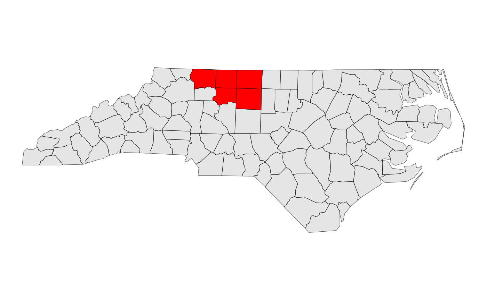
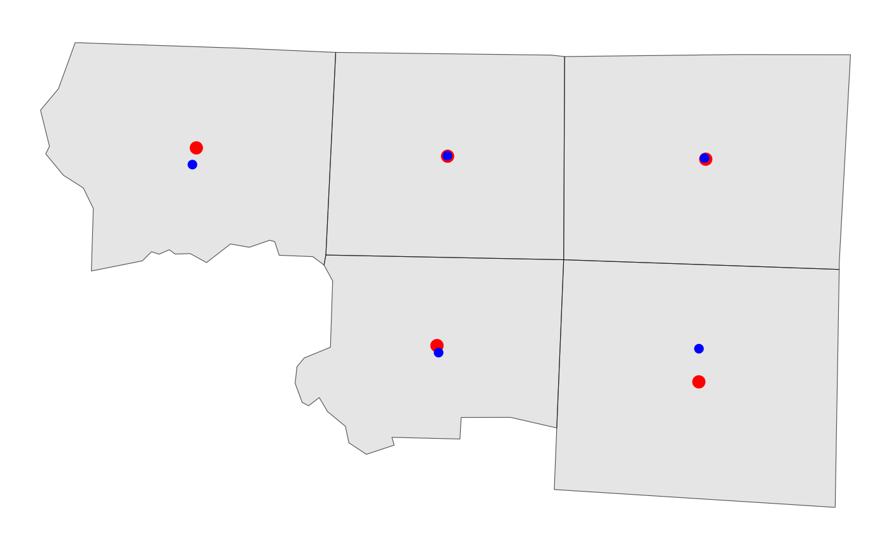
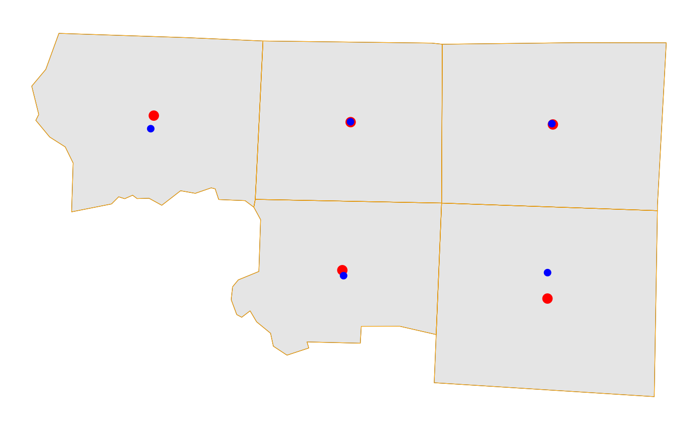
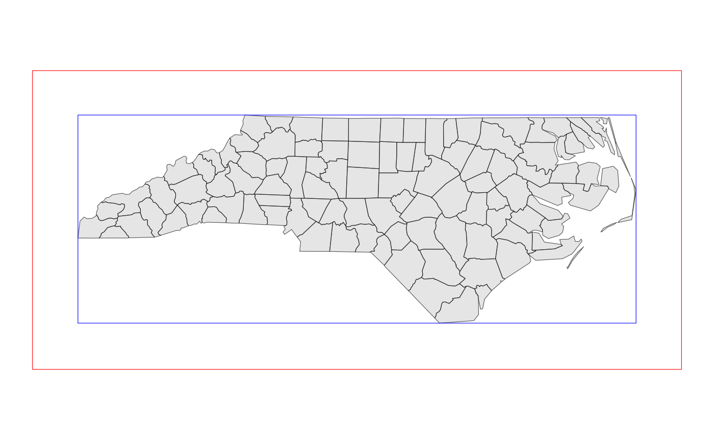
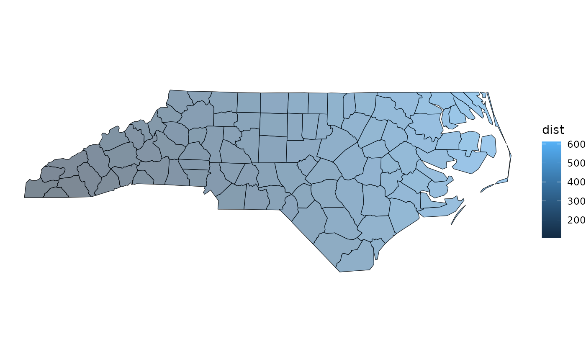
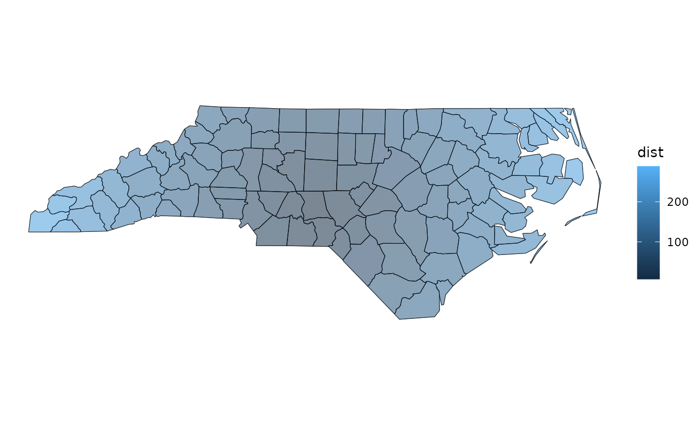

# Introduction to sfext

``` r

library(sfext)
library(dplyr)
library(ggplot2)

theme_set(theme_void())
```

The {sfext} package has several categories of functions:

- Functions for reading and writing spatial data
- Converting the class or geometry of objects
- Modifying sf, sfc, and bbox objects
- Getting information about sf, sfc, and bbox objects
- Working with units and scales

## Reading and writing sf objects

### Reading sf objects

[`read_sf_ext()`](https://elipousson.github.io/sfext/reference/read_sf_ext.md)
calls one of four other functions depending on the input parameters:

- [`read_sf_path()`](https://elipousson.github.io/sfext/reference/read_sf_ext.md)
- [`read_sf_url()`](https://elipousson.github.io/sfext/reference/read_sf_ext.md)
- [`read_sf_pkg()`](https://elipousson.github.io/sfext/reference/read_sf_ext.md)
- [`read_sf_query()`](https://elipousson.github.io/sfext/reference/read_sf_ext.md)

[`read_sf_path()`](https://elipousson.github.io/sfext/reference/read_sf_ext.md)
is similar to
[`sf::read_sf`](https://r-spatial.github.io/sf/reference/st_read.html)
but has a few additional features. It checks the existence of a file
before reading, supports the creation of wkt_filter parameters based on
a bounding box, and supports conversion of tabular data to simple
feature objects.

``` r

nc <- read_sf_ext(path = system.file("shape/nc.shp", package = "sf"))
# This is equivalent to read_sf_path(system.file("shape/nc.shp", package = "sf"))
# Or sf::read_sf(dsn = system.file("shape/nc.shp", package = "sf"))

glimpse(nc)
#> Rows: 100
#> Columns: 15
#> $ AREA      <dbl> 0.114, 0.061, 0.143, 0.070, 0.153, 0.097, 0.062, 0.091, 0.11…
#> $ PERIMETER <dbl> 1.442, 1.231, 1.630, 2.968, 2.206, 1.670, 1.547, 1.284, 1.42…
#> $ CNTY_     <dbl> 1825, 1827, 1828, 1831, 1832, 1833, 1834, 1835, 1836, 1837, …
#> $ CNTY_ID   <dbl> 1825, 1827, 1828, 1831, 1832, 1833, 1834, 1835, 1836, 1837, …
#> $ NAME      <chr> "Ashe", "Alleghany", "Surry", "Currituck", "Northampton", "H…
#> $ FIPS      <chr> "37009", "37005", "37171", "37053", "37131", "37091", "37029…
#> $ FIPSNO    <dbl> 37009, 37005, 37171, 37053, 37131, 37091, 37029, 37073, 3718…
#> $ CRESS_ID  <int> 5, 3, 86, 27, 66, 46, 15, 37, 93, 85, 17, 79, 39, 73, 91, 42…
#> $ BIR74     <dbl> 1091, 487, 3188, 508, 1421, 1452, 286, 420, 968, 1612, 1035,…
#> $ SID74     <dbl> 1, 0, 5, 1, 9, 7, 0, 0, 4, 1, 2, 16, 4, 4, 4, 18, 3, 4, 1, 1…
#> $ NWBIR74   <dbl> 10, 10, 208, 123, 1066, 954, 115, 254, 748, 160, 550, 1243, …
#> $ BIR79     <dbl> 1364, 542, 3616, 830, 1606, 1838, 350, 594, 1190, 2038, 1253…
#> $ SID79     <dbl> 0, 3, 6, 2, 3, 5, 2, 2, 2, 5, 2, 5, 4, 4, 6, 17, 4, 7, 1, 0,…
#> $ NWBIR79   <dbl> 19, 12, 260, 145, 1197, 1237, 139, 371, 844, 176, 597, 1369,…
#> $ geometry  <MULTIPOLYGON [°]> MULTIPOLYGON (((-81.47276 3..., MULTIPOLYGON ((…
```

``` r

bbox <- as_bbox(nc[10, ])

nc_in_bbox <- read_sf_ext(path = system.file("shape/nc.shp", package = "sf"), bbox = bbox)

nc_basemap <-
  ggplot() +
  geom_sf(data = nc)

nc_basemap +
  geom_sf(data = nc_in_bbox, fill = "red")
```



The second,
[`read_sf_url()`](https://elipousson.github.io/sfext/reference/read_sf_ext.md),
that supports reading url that are already supported by
[`sf::read_sf`](https://r-spatial.github.io/sf/reference/st_read.html)
but also supports ArcGIS Feature Layers (using the
[{esri2sf}](https://github.com/elipousson/esri2sf) package) and URLs for
tabular data (including both CSV files and Google Sheets). Several
functions also support queries based on a name and name_col value
(generating a simple SQL query) based on the provided values.

``` r

sample_esri_url <- "https://services.arcgis.com/P3ePLMYs2RVChkJx/ArcGIS/rest/services/USA_Boundaries_2022/FeatureServer/1"
states <- read_sf_esri(url = sample_esri_url)
#> ── Downloading "USA_State" from <https://services.arcgis.com/P3ePLMYs2RVChkJx/Ar
#> Layer type: "Feature Layer"
#> Geometry type: "esriGeometryPolygon"
#> Service CRS: "EPSG:4326"
#> Output CRS: "EPSG:4326"
#> 
# This is equivalent to read_sf_url(sample_esri_url)
# Or esri2sf::esri2sf(url = sample_esri_url)

# read_sf_esri and read_sf_query both support the name and name_col parameters
# These parameters also work with read_sf_pkg for cached and extdata files
nc_esri <- read_sf_ext(url = sample_esri_url, name_col = "STATE_NAME", name = "North Carolina")
#> ── Downloading "USA_State" from <https://services.arcgis.com/P3ePLMYs2RVChkJx/Ar
#> Layer type: "Feature Layer"
#> Geometry type: "esriGeometryPolygon"
#> Service CRS: "EPSG:4326"
#> Output CRS: "EPSG:4326"
#> 

ggplot() +
  geom_sf(data = states) +
  geom_sf(data = nc_esri, fill = "red")
```


The read functions also support URLs for GitHub Gists (assuming the
first file in the Gist is a spatial data file) or Google MyMaps.

``` r

gmap_data <- read_sf_ext(url = "https://www.google.com/maps/d/u/0/viewer?mid=1CEssu_neU7lx_vAZs5qpufOBoUQ&ll=-3.81666561775622e-14%2C0&z=1")

ggplot() +
  geom_sf(data = gmap_data[2, ])
```


The third,
[`read_sf_pkg()`](https://elipousson.github.io/sfext/reference/read_sf_ext.md),
can load spatial data from any installed package including exported
data, files in the extdata folder, or data in a package-specific cache
folder. This is particularly useful when working with spatial data
packages such as
[{mapbaltimore}](https://elipousson.github.io/mapbaltimore/) or
[{mapmaryland}](https://elipousson.github.io/mapmaryland/).

The fourth,
[`read_sf_query()`](https://elipousson.github.io/sfext/reference/read_sf_ext.md),
is most similar to
[`sf::read_sf`](https://r-spatial.github.io/sf/reference/st_read.html)
but provides an optional spatial filter based on the bbox parameter and
supports the creation of queries using a basic name and name_col
parameter.

### Writing sf objects

[`write_sf_ext()`](https://elipousson.github.io/sfext/reference/write_sf_ext.md)
wraps
[`sf::write_sf`](https://r-spatial.github.io/sf/reference/st_write.html)
but uses
[`filenamr::make_filename()`](https://elipousson.github.io/filenamr/reference/make_filename.html)
to support the creation of consistent file names using labels or date
prefixes to organize exports.

``` r

filenamr::make_filename(
  name = "Ashe County",
  label = "NC",
  prefix = "date",
  fileext = "gpkg"
)
#> [1] "2026-09-16_nc_ashe_county.gpkg"
```

[`write_sf_ext()`](https://elipousson.github.io/sfext/reference/write_sf_ext.md)
also supports the automatic creation of destination folders and the use
of a package-specific cache folder created by
[`rappdirs::user_cache_dir()`](https://rappdirs.r-lib.org/reference/user_cache_dir.html).
These functions are now in the `filenamr` package.

## Converting sf objects

### Checking and converting sf objects

There are several helper functions that are used extensively by the
package itself. While these conversions are easy to do with existing
{sf} functions, these alternatives follow a tidyverse style syntax and
support a wider range of input values.

``` r

is_sf(nc)
#> [1] TRUE

is_sfc(nc$geometry)
#> [1] TRUE

nc_bbox <- as_bbox(nc)

is_bbox(nc_bbox)
#> [1] TRUE
```

The ext parameter can be used to make
[`is_sf()`](https://elipousson.github.io/sfext/reference/is_sf.md) more
general allowing sf, sfc, or bbox objects instead of just sf objects.

``` r

is_sf(nc$geometry)
#> [1] FALSE

is_sf(nc$geometry, ext = TRUE)
#> [1] TRUE
```

There are similar functions for checking and converting the geometry
type for an object including
[`is_point()`](https://elipousson.github.io/sfext/reference/is_geom_type.md),
[`is_polygon()`](https://elipousson.github.io/sfext/reference/is_geom_type.md),
[`is_line()`](https://elipousson.github.io/sfext/reference/is_geom_type.md),
and others.

``` r

is_point(nc)
#> [1] FALSE

is_point(suppressWarnings(sf::st_centroid(nc)))
#> [1] TRUE

# as_point returns an sfg object
is_sfg(as_point(nc))
#> [1] TRUE

# as_points returns an sfc object (and accepts numeric inputs as well as sfg)
is_sfc(as_points(c(-79.40065, 35.55937), crs = 4326))
#> [1] TRUE
```

### Converting to and from data frames

By default the conversion from sf to data frame object, uses the
centroid of any polygon. It can also use a surface point from
[`sf::st_point_on_surface`](https://r-spatial.github.io/sf/reference/geos_unary.html)

``` r

df_centroid <- sf_to_df(nc_in_bbox)
df_surface_point <- sf_to_df(nc_in_bbox, geometry = "surface point")
```

These can be converted back to an sf object but the point geometry is
used instead of the original polygon:

``` r

df_centroid_sf <- df_to_sf(df_centroid, crs = 3857)
df_surface_point_sf <- df_to_sf(df_surface_point, crs = 3857)

df_example_map <-
  ggplot() +
  geom_sf(data = nc_in_bbox) +
  geom_sf(data = df_centroid_sf, color = "red", size = 3) +
  geom_sf(data = df_surface_point_sf, color = "blue", size = 2)

df_example_map
```



Alternatively,
[`sf_to_df()`](https://elipousson.github.io/sfext/reference/sf_to_df.md)
can also use well known text as an output format:

``` r

df_wkt <- sf_to_df(nc_in_bbox, geometry = "wkt")

glimpse(df_wkt)
#> Rows: 5
#> Columns: 15
#> $ AREA      <dbl> 0.143, 0.124, 0.153, 0.108, 0.170
#> $ PERIMETER <dbl> 1.630, 1.428, 1.616, 1.483, 1.680
#> $ CNTY_     <dbl> 1828, 1837, 1839, 1900, 1903
#> $ CNTY_ID   <dbl> 1828, 1837, 1839, 1900, 1903
#> $ NAME      <chr> "Surry", "Stokes", "Rockingham", "Forsyth", "Guilford"
#> $ FIPS      <chr> "37171", "37169", "37157", "37067", "37081"
#> $ FIPSNO    <dbl> 37171, 37169, 37157, 37067, 37081
#> $ CRESS_ID  <int> 86, 85, 79, 34, 41
#> $ BIR74     <dbl> 3188, 1612, 4449, 11858, 16184
#> $ SID74     <dbl> 5, 1, 16, 10, 23
#> $ NWBIR74   <dbl> 208, 160, 1243, 3919, 5483
#> $ BIR79     <dbl> 3616, 2038, 5386, 15704, 20543
#> $ SID79     <dbl> 6, 5, 5, 18, 38
#> $ NWBIR79   <dbl> 260, 176, 1369, 5031, 7089
#> $ wkt       <chr> "POLYGON ((-80.45614 36.24264, -80.47618 36.25481, -80.53668…

df_example_map +
  geom_sf(data = df_to_sf(df_wkt), color = "orange", fill = NA)
```



The [tidygeocoder](https://jessecambon.github.io/tidygeocoder/) package
is also used to support conversion of address vectors or data frames.

``` r

address_to_sf(x = c("350 Fifth Avenue, New York, NY 10118"))
#> Passing 1 address to the Nominatim single address geocoder
#> Query completed in: 7.1 seconds
#> Simple feature collection with 1 feature and 3 fields
#> Attribute-geometry relationships: constant (3)
#> Geometry type: POINT
#> Dimension:     XY
#> Bounding box:  xmin: -73.80718 ymin: 40.9161 xmax: -73.80718 ymax: 40.9161
#> Geodetic CRS:  WGS 84
#> # A tibble: 1 × 4
#>   address                                lat   lon            geometry
#> * <chr>                                <dbl> <dbl>         <POINT [°]>
#> 1 350 Fifth Avenue, New York, NY 10118  40.9 -73.8 (-73.80718 40.9161)
```

## Modifying sf objects

The next group of functions often provide similar functionality to
standard {sf} functions but, again, allow a wider range of inputs and
outputs or offer extra features. For example,
[`st_bbox_ext()`](https://elipousson.github.io/sfext/reference/st_bbox_ext.md)
also wraps
[`sf::st_buffer`](https://r-spatial.github.io/sf/reference/geos_unary.html)
and uses a helper function based on
[`units::set_units`](https://r-quantities.github.io/units/reference/units.html)
to a buffer distance of any valid distance unit.

``` r

nc_bbox <- st_bbox_ext(nc, class = "sf")
# Similar to sf::st_sf(sf::st_as_sfc(sf::st_bbox(nc)))

nc_bbox_buffer <- st_bbox_ext(nc, dist = 50, unit = "mi", class = "sf")
# Similar to sf::st_buffer(nc, dist = units::as_units(50, "mi"))

nc_basemap +
  geom_sf(data = nc_bbox, fill = NA, color = "blue") +
  geom_sf(data = nc_bbox_buffer, fill = NA, color = "red")
```



Other notable functions in this category include:

- [`st_transform_ext()`](https://elipousson.github.io/sfext/reference/st_transform_ext.md):
  takes sf, sfc, or bbox objects as the crs parameter for
  [`sf::st_transform()`](https://r-spatial.github.io/sf/reference/st_transform.html)
  and supports lists of sf objects (look for the `allow_list = TRUE`
  parameter to see which functions support lists)
- [`st_union_ext()`](https://elipousson.github.io/sfext/reference/st_union_ext.md):
  unions geometry while also collapsing a name column into a single
  character string using the
  [`cli::pluralize`](https://cli.r-lib.org/reference/pluralize.html)
  function
- [`st_erase()`](https://elipousson.github.io/sfext/reference/st_erase.md):
  checks the validity of inputs with
  [`sf::st_is_valid`](https://r-spatial.github.io/sf/reference/valid.html)
  before and after using
  [`sf::st_difference`](https://r-spatial.github.io/sf/reference/geos_binary_ops.html)
  or (if flip = TRUE)
  [`sf::st_difference`](https://r-spatial.github.io/sf/reference/geos_binary_ops.html)

## Getting information about sf, sfc, and bbox objects

There are also several functions that return information about the
geometry of input objects. Typically, these functions bind the
information as a new column to an existing sf input (and convert sfc
input objects to sf results).

The
[`get_length()`](https://elipousson.github.io/sfext/reference/get_measurements.md)
function wraps
[`sf::st_length`](https://r-spatial.github.io/sf/reference/geos_measures.html)
and (for POLYGON geometries only) `lwgeom::st_perimeter`:

``` r

example_line <- as_line(as_point(nc[1, ]), as_point(nc[2, ]), crs = 4326)

glimpse(get_length(example_line))
#> Rows: 1
#> Columns: 2
#> $ length   [m] 34020.35 [m]
#> $ geometry <LINESTRING [°]> LINESTRING (-81.49823 36.43...
```

The
[`get_area()`](https://elipousson.github.io/sfext/reference/get_measurements.md)
function wraps
[`sf::st_area()`](https://r-spatial.github.io/sf/reference/geos_measures.html):

``` r

glimpse(get_area(nc[1:3, ], unit = "mi^2"))
#> Rows: 3
#> Columns: 16
#> $ AREA      <dbl> 0.114, 0.061, 0.143
#> $ PERIMETER <dbl> 1.442, 1.231, 1.630
#> $ CNTY_     <dbl> 1825, 1827, 1828
#> $ CNTY_ID   <dbl> 1825, 1827, 1828
#> $ NAME      <chr> "Ashe", "Alleghany", "Surry"
#> $ FIPS      <chr> "37009", "37005", "37171"
#> $ FIPSNO    <dbl> 37009, 37005, 37171
#> $ CRESS_ID  <int> 5, 3, 86
#> $ BIR74     <dbl> 1091, 487, 3188
#> $ SID74     <dbl> 1, 0, 5
#> $ NWBIR74   <dbl> 10, 10, 208
#> $ BIR79     <dbl> 1364, 542, 3616
#> $ SID79     <dbl> 0, 3, 6
#> $ NWBIR79   <dbl> 19, 12, 260
#> $ area      [mi^2] 439.0398 [mi^2], 235.8760 [mi^2], 549.4795 [mi^2]
#> $ geometry  <MULTIPOLYGON [°]> MULTIPOLYGON (((-81.47276 3..., MULTIPOLYGON (((-81.23989 3.…
```

[`get_dist()`](https://elipousson.github.io/sfext/reference/get_measurements.md)
supports a more varied range of options including using the “to”
parameter to define a corner or center of the input sf object bounding
box.

``` r

nc <- sf::st_transform(nc, 3857)

# use drop = TRUE, to drop the units class and return a numeric column
dist_example_min <- get_dist(nc, to = c("xmin", "ymin"), unit = "mi", drop = TRUE)

glimpse(select(dist_example_min, NAME, dist))
#> Rows: 100
#> Columns: 3
#> $ NAME     <chr> "Ashe", "Alleghany", "Surry", "Currituck", "Northampton", "He…
#> $ dist     <dbl[,1]> <matrix[26 x 1]>
#> $ geometry <MULTIPOLYGON [m]> MULTIPOLYGON (((-9069486 43..., MULTIPOLYGON (((-9043563 …

nc_basemap +
  geom_sf(data = dist_example_min, aes(fill = dist), alpha = 0.5)
```



``` r


dist_example_mid <- get_dist(nc, to = c("xmid", "ymid"), unit = "mi", drop = TRUE)

nc_basemap +
  geom_sf(data = dist_example_mid, aes(fill = dist), alpha = 0.5)
```


